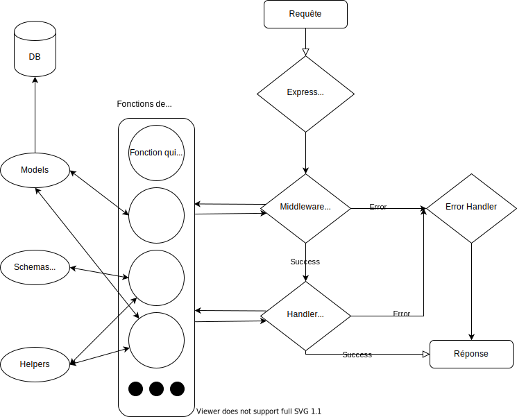

# Simple CRUD avec Rest et Javascript

Ce projet est un simple CRUD pour des Utilisateurs avec des Articles. Le tout avec une api Rest et Javascript.

## 1. Lancer le projet

## 2. Endpoint api

## 3. Paquets

**express**: Pour gérer les requêtes et leur retour, c'est le coeur du projet.

**yup**: Pour la validation de schema

**pino**: Pour logger (requête, data, etc). Utile pour analyser les logs plus tard.

**objection et knex**: Pour gérer les données et la connexion à la base de données. (SQLite ici pour que l'installation soit simple)

**body-parser**: Présent pour parser le body des requêtes celon les format reçu (JSON, FormData, etc.)

**bcryptjs**: Pour encoder une chaine de charactères et vérifier qu'une valeur match avec l'encodage (Pour les mots de passe).

**jsonwebtoken**: Pour créer un JWT(jsonwebtoken) qui contient des données, ici ce sera notre token d'authentification.

**nodemon**: Permet de développement de relancer tout seul le serveur à l'update d'un fichier de l'api.

## 4. Architecture

L'architecture est simple mais fonctionnel, le but du projet est seulement de faire tourner une api avec des fonctionnalités basiques. Le tout pour montrer le fonctionnement avec NodeJS pour le côté backend.

**Voici les dossiers et leur utilité:**

- **config**: Pour tous les fichiers de configuration du projet (api, db, routes, etc).
- **controllers**: Tous les controllers de l'application qui vont gérer le traitement des requêtes.
- **helpers**: Set de fonctions ou classes qui aide au fonctionnement du projet
- **middlewares**: Dossier qui regroupe tous les middlewares (Auth, Permissions, etc)
- **migrations**: Fichiers de migrations pour la base de données
- **models**: Models qui permettent de facilement avoir accès au données de la base de données
- **schemas**: Tous les schemas de validation (query, params, body, etc)
- **src**: Dossier qui a toutes les sources du projet

## 5. Fonctionnement

Le fonctionnement est très basique et est illustré avec ce schema:

Le middleware a en soit le même fonctionnement que le handler, seulement il passera a prochain middleware si il réussit et le dernier est le handler qui lui s'occupera d'envoyer la réponse.

Ici pour l'authentification une mémoire interne pour les tokens est utilisé, il faudrait en soit utiliser un redis pour le faire ou autre mais tout est fait de manière très simple histoire de voir comment démarrer et faire un projet avec NodeJS et Javascript

## 6. Avantages / Inconvénients

Dans ce projet il y a beaucoup d'inconvénient surtout au niveau des librairies choisies et du langage. Mais il y a des avantages aussi.

### A. Avantages

- Architecture simple, facile d'ajouter de nouvelles fonctionnalités sans trop se perdre
- Yup est facile à utiliser, fonctionnel et renvoie des erreurs compréhensibles

### B. Inconvénients

- Express, devoir faire une fonction `asyncHandler` pour gérer les fonctions asynchrone en JS (À l'avenir prendre Fastify ou autre chose).
- Objection qui pour moi ce dit être un ORM mais ne fait pas vraiment grand chose de plus que Knex, je pense qu'on peut s'en passer ou prendre Sequelize à la place.
- Pas d'IOC (inversion de contrôle) et de DI (injection de dépendance) donc pour tester c'est plus compliqué.
- Pas de tests dans le projet

## 7. Retours

Surtout n'hésitez pas à me faire des retours par issue ou sur [twitter](https://twitter.com/ventincio) si vous ne comprennez pas un passage, je me ferai un plaisir de le documenter à coup de commentaire 🙂
